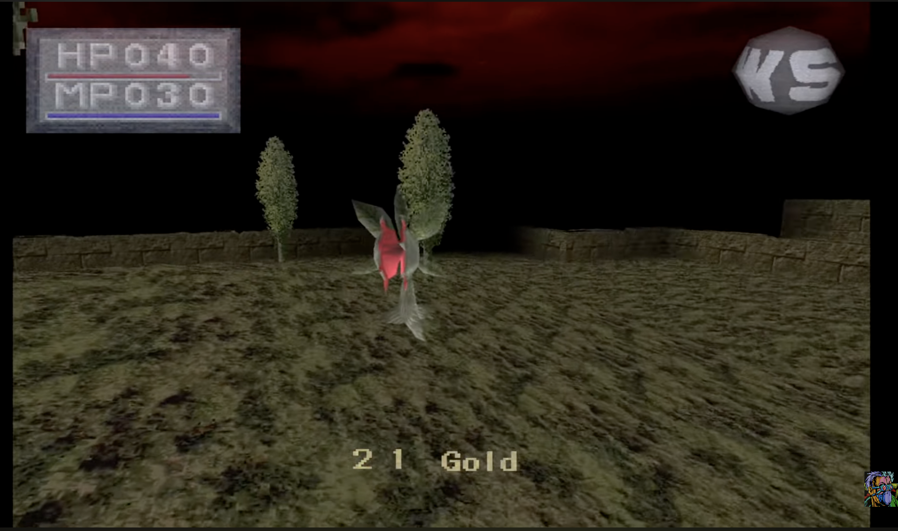
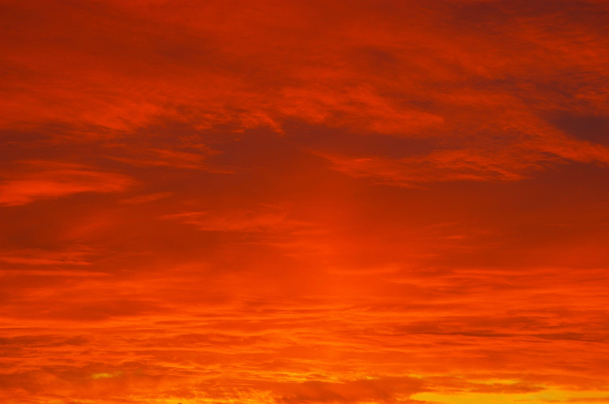
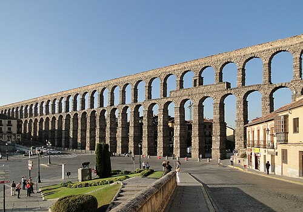
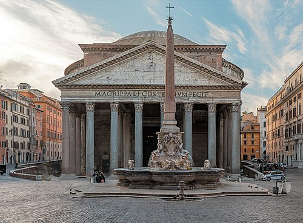
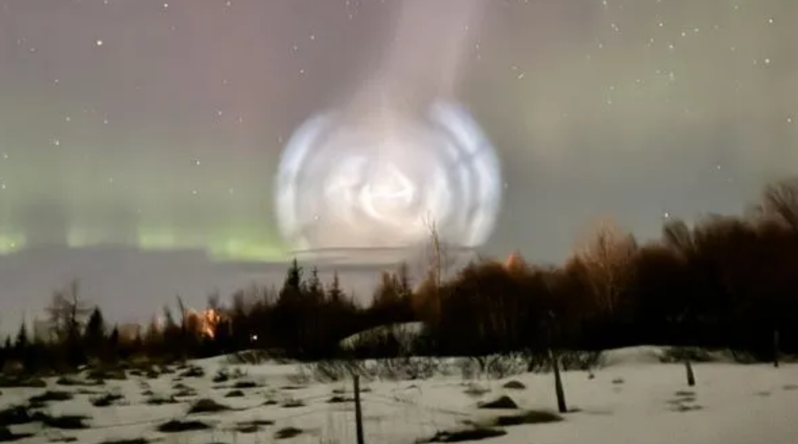
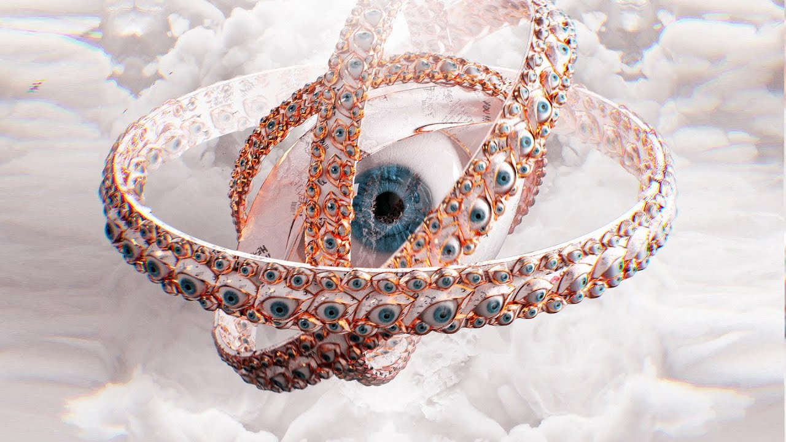
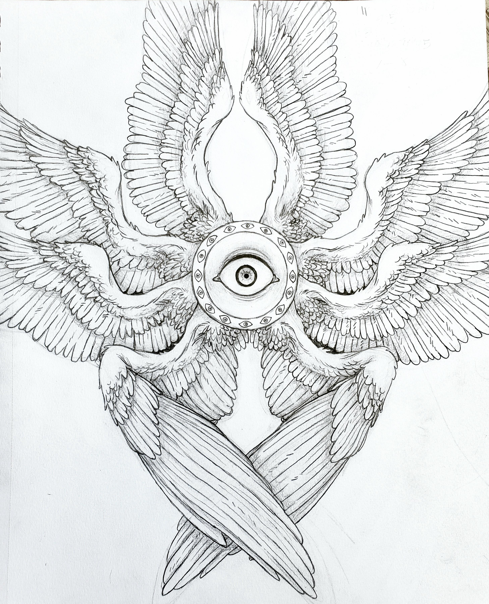
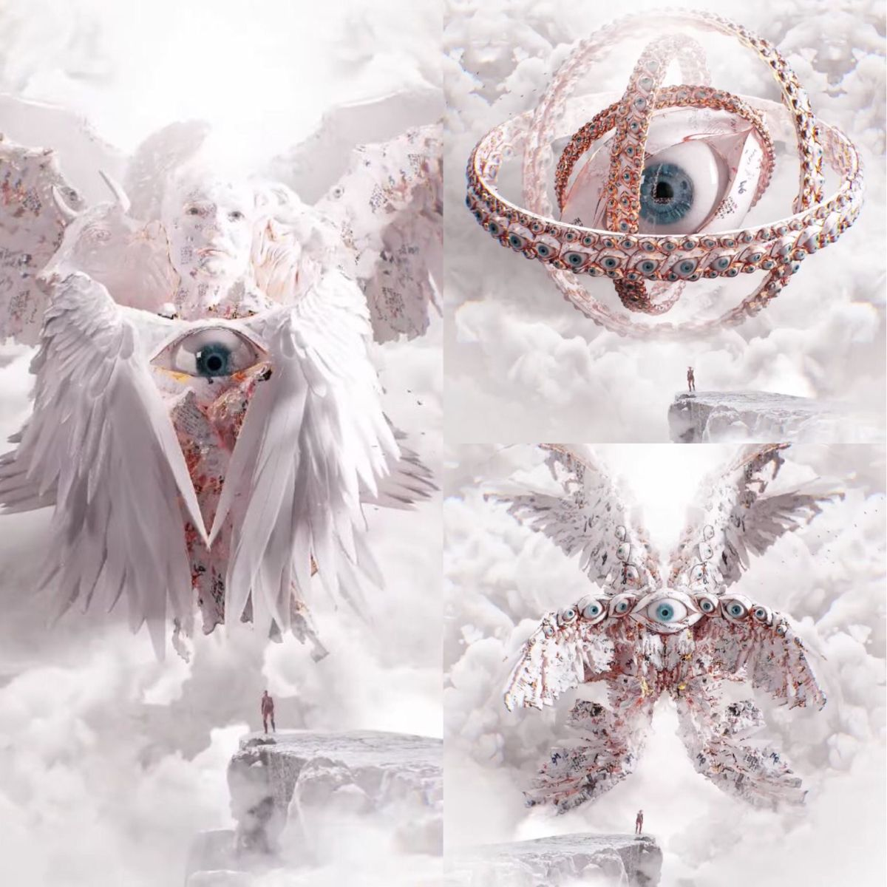
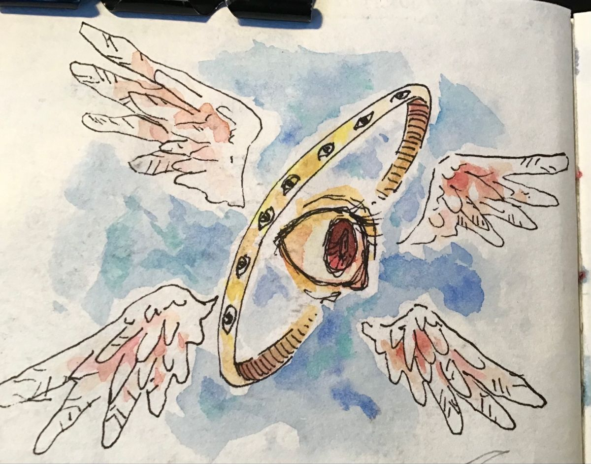

# Presentation 1

Main aesthetic inspiration

Sky

Roman architecture
Meant to contrast with the rest of the landscape
Compliments the Christian elements of the game

A swirl in the sky
Meant to represent God always watching you

Biblically accurate angels
These are the enemies hunting you down
Could be stealth or fighting (undetermined)

